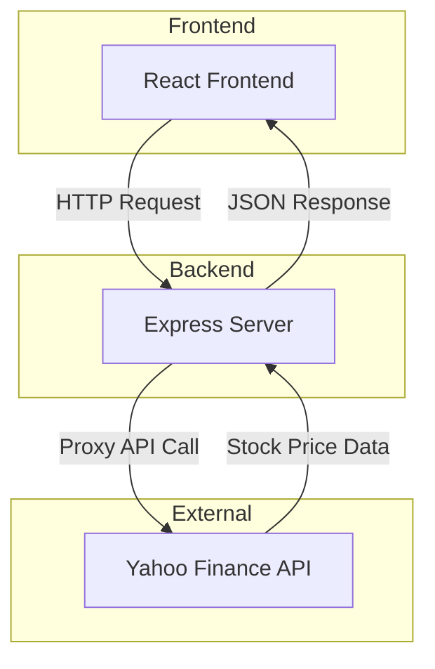

# Stock Gift Value Calculator

A React web application that calculates the IRS-approved donated value of stock gifts using IRS guidelines.

## Overview

This application helps users calculate the value of stock donations according to IRS rules. The IRS specifies that the value of donated stock is calculated as the average of the high and low prices on the donation date.

**Formula**: `(High + Low) / 2 × Number of Shares`

## Features

- Simple input interface for donation date, ticker symbol, and number of shares
- **Ticker autocomplete** with Yahoo Finance search integration
- **Improved tabbing flow** for efficient data entry
  - Single Tab press moves to next field (no internal field navigation)
  - Free-form date entry in MM/DD/YYYY format
  - Ticker autocomplete doesn't capture Tab key
  - Delete button skipped in tab order
- Automatic calculation as you type
- Support for multiple stock gifts
- Fractional cents precision for accurate calculations
- Smart caching to minimize API calls
- Comprehensive error handling
- Responsive design

## Tech Stack

- **React 18** + **TypeScript** - UI framework with type safety
- **Vite 7** - Fast build tool and dev server
- **Node.js 22** + **Express 5** - Modern ES modules backend for API and static file serving
- **Vitest + MSW** - Unit testing with API mocking
- **Yahoo Finance API** - Historical stock price data (proxied through backend)
- **Docker** - Production containerization with multi-stage builds
- **CSS Modules** - Component-scoped styling
- **GitHub Actions** - CI/CD with automated testing and Docker builds

## Architecture

This is a full-stack application with an Express backend that serves both API endpoints and static files:



**Why a backend?**
- Yahoo Finance doesn't support CORS (requires server-side proxy)
- Secure API handling
- ES modules with Node.js 22+
- Express 5 for modern async/await patterns

**Clean architecture:**
- `shared/types.ts` - TypeScript types shared between client and server (single source of truth)
- `api/handler.ts` - Platform-agnostic business logic (fully testable)
- `api/server.ts` - Express server that uses the handler and serves static files
- `api/validators.ts` - Request validation logic
- `api/yahooFinanceClient.ts` - Yahoo Finance API integration
- `api/tickerSearchClient.ts` - Ticker autocomplete with caching

## Getting Started

### Prerequisites

- **Node.js 22+** (required for Vite 7+)
- **npm 10+**

Install via [nvm](https://github.com/nvm-sh/nvm?tab=readme-ov-file#installing-and-updating) (recommended) or download from [nodejs.org](https://nodejs.org/)

### Installation

```bash
cd typescript/stock-gift-value
npm install
```

### Development

Run both frontend and backend in separate terminals:

**Terminal 1 - Frontend:**
```bash
npm run dev
```
Runs on http://localhost:5173 with hot reload

**Terminal 2 - Backend:**
```bash
npm run dev:api
```
Runs on http://localhost:3001 with auto-restart

The Vite dev server proxies `/api/*` requests to the Express server.

### Production Build

```bash
npm run build:all  # Builds both frontend and server
npm start          # Runs production server on port 3001
```

**Environment variables:**
Create a `.env` file:
```bash
PORT=3001
NODE_ENV=production
```

### Testing

```bash
npm test                  # Run tests once
npm run test:watch        # Run tests in watch mode
npm run test:coverage     # Run tests with coverage
```

### Code Quality

**IMPORTANT:** Always run code quality checks before pushing changes to ensure CI/CD passes.

```bash
# Install dependencies first (required for type checking)
npm ci

# Run all quality checks
npm run typecheck         # TypeScript type checking (critical!)
npm run lint              # ESLint code quality checks
npm run format:check      # Check Prettier formatting
npm run test:coverage     # Run tests with coverage

# Or run the full quality suite at once
npm run quality           # Runs all of the above
```

**Common issues:**
- If `typecheck` or `build:server` fails with module resolution errors, ensure `npm ci` has been run
- The project uses strict TypeScript settings - all type errors must be resolved
- Avoid using linter suppression comments (`eslint-disable`) - refactor code instead

**For more help:** See [TROUBLESHOOTING.md](./TROUBLESHOOTING.md) for detailed solutions to common issues. If you resolve a new issue, please document it there to help others.

## Deployment

See **[DEPLOY.md](./DEPLOY.md)** for comprehensive deployment documentation, including:

- **Automated deployment** via GitHub Actions (triggered by releases with `stock-gift-value/v*` tags)
- **GCP setup instructions** for Workload Identity Federation and minimal permissions
- **Manual deployment options**: GCP Compute Engine, Cloud Run, and other platforms
- **Docker deployment** and local testing

## Usage

1. Enter the **donation date** (must be a past date)
2. Enter the **ticker symbol** (e.g., AAPL, BRK-B, MSFT)
3. Enter the **number of shares** donated
4. The **IRS-approved value** is calculated automatically

Click **"+ Add Another Stock Gift"** for multiple donations.

## Example

For the test case:
- Date: 11/7/2025
- Ticker: BRK-B
- Shares: 34
- High: $500.16, Low: $493.35
- **Calculated Value: $16,889.67**

The calculation: `(500.16 + 493.35) / 2 × 34 = 496.755 × 34 = $16,889.67`

## Project Structure

```
typescript/stock-gift-value/
├── api/                     # Backend API
│   ├── handler.ts           # Platform-agnostic business logic
│   ├── server.ts            # Express server
│   ├── validators.ts        # Request validation
│   ├── yahooFinanceClient.ts # Yahoo Finance integration
│   ├── tickerSearchClient.ts # Ticker autocomplete
│   ├── constants.ts         # Shared constants
│   ├── logger.ts            # Logging utilities
│   └── __tests__/           # API tests
├── shared/                  # Shared code between client and server
│   └── types.ts             # Shared TypeScript type definitions
├── src/                     # React frontend
│   ├── components/          # React components
│   ├── hooks/               # Custom React hooks
│   ├── services/            # API client and caching
│   ├── utils/               # Helper functions
│   ├── constants/           # Constants
│   └── test/                # Test configuration
├── .github/                 # GitHub Actions workflows
│   └── workflows/
│       └── ci.yml           # CI/CD pipeline
├── dist/                    # Built frontend (gitignored)
├── dist-server/             # Built server (gitignored)
├── package.json
├── tsconfig.json            # Frontend TypeScript config
├── tsconfig.server.json     # Server TypeScript config
├── Dockerfile               # Production Docker image
└── vite.config.ts
```

## Scripts Reference

| Script | Description |
|--------|-------------|
| `npm run dev` | Start Vite dev server (frontend) |
| `npm run dev:api` | Start Express dev server (backend) |
| `npm run build` | Build frontend to `dist/` |
| `npm run build:server` | Build server to `dist-server/` |
| `npm run build:all` | Build both frontend and server |
| `npm start` | Run production server |
| `npm test` | Run tests once |
| `npm run test:watch` | Run tests in watch mode |
| `npm run test:coverage` | Run tests with coverage |
| `npm run lint` | Run ESLint |
| `npm run format` | Format code with Prettier |
| `npm run format:check` | Check code formatting |

## CI/CD

GitHub Actions workflow (`.github/workflows/stock-gift-value-ci.yml`) automatically runs on all pull requests and pushes to main:

**Docker Build Test:**
1. Builds production Docker image using multi-stage build
2. Starts container and verifies it runs successfully
3. Tests `/health` endpoint to ensure server is responding
4. Uses GitHub Actions cache for faster builds

**Tests and Linting:**
1. Type checking with TypeScript strict mode (`npm run typecheck`)
2. ESLint code quality checks (`npm run lint`)
3. Unit tests (70+ tests) with Vitest (`npm run test:coverage`)
4. Code coverage reporting to Codecov

All checks must pass before merging to main. The workflow validates both the application code and the Docker deployment.

## IRS Guidelines

According to IRS guidelines, the fair market value of donated stock is determined by taking the mean between the highest and lowest quoted selling prices on the valuation date. This application implements this calculation precisely.

## License

This project is part of the ai-playground repository.

## Contributing

1. Ensure all tests pass: `npm test`
2. Ensure code is formatted: `npm run format`
3. Ensure linting passes: `npm run lint`
4. Build successfully: `npm run build:all`
