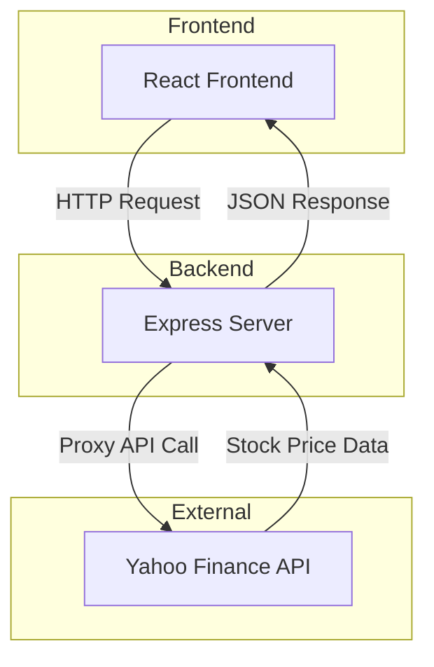

# Stock Gift Value Calculator

A React web application that calculates the IRS-approved donated value of stock gifts using IRS guidelines.

## Overview

This application helps users calculate the value of stock donations according to IRS rules. The IRS specifies that the value of donated stock is calculated as the average of the high and low prices on the donation date.

**Formula**: `(High + Low) / 2 × Number of Shares`

## Features

- Simple input interface for donation date, ticker symbol, and number of shares
- **Ticker autocomplete** with Yahoo Finance search integration
- **Improved tabbing flow** for efficient data entry
  - Single Tab press moves to next field (no internal field navigation)
  - Free-form date entry in MM/DD/YYYY format
  - Ticker autocomplete doesn't capture Tab key
  - Delete button skipped in tab order
- Automatic calculation as you type
- Support for multiple stock gifts
- Fractional cents precision for accurate calculations
- Smart caching to minimize API calls
- Comprehensive error handling
- Responsive design

## Tech Stack

- **React 18** + **TypeScript** - UI framework with type safety
- **Vite 7** - Fast build tool and dev server
- **Node.js 22** + **Express 5** - Modern ES modules backend for API and static file serving
- **Vitest + MSW** - Unit testing with API mocking
- **Yahoo Finance API** - Historical stock price data (proxied through backend)
- **Docker** - Production containerization with multi-stage builds
- **CSS Modules** - Component-scoped styling
- **GitHub Actions** - CI/CD with automated testing and Docker builds

## Architecture

This is a full-stack application with an Express backend that serves both API endpoints and static files:



**Why a backend?**
- Yahoo Finance doesn't support CORS (requires server-side proxy)
- Secure API handling
- ES modules with Node.js 22+
- Express 5 for modern async/await patterns

**Clean architecture:**
- `shared/types.ts` - TypeScript types shared between client and server (single source of truth)
- `api/handler.ts` - Platform-agnostic business logic (fully testable)
- `api/server.ts` - Express server that uses the handler and serves static files
- `api/validators.ts` - Request validation logic
- `api/yahooFinanceClient.ts` - Yahoo Finance API integration
- `api/tickerSearchClient.ts` - Ticker autocomplete with caching

## Getting Started

### Prerequisites

- **Node.js 22+** (required for Vite 7+)
- **npm 10+**

Install via [nvm](https://github.com/nvm-sh/nvm?tab=readme-ov-file#installing-and-updating) (recommended) or download from [nodejs.org](https://nodejs.org/)

### Installation

```bash
cd typescript/stock-gift-value
npm install
```

### Development

Run both frontend and backend in separate terminals:

**Terminal 1 - Frontend:**
```bash
npm run dev
```
Runs on http://localhost:5173 with hot reload

**Terminal 2 - Backend:**
```bash
npm run dev:api
```
Runs on http://localhost:3001 with auto-restart

The Vite dev server proxies `/api/*` requests to the Express server.

### Production Build

```bash
npm run build:all  # Builds both frontend and server
npm start          # Runs production server on port 3001
```

**Environment variables:**
Create a `.env` file:
```bash
PORT=3001
NODE_ENV=production
```

### Testing

```bash
npm test                  # Run tests once
npm run test:watch        # Run tests in watch mode
npm run test:coverage     # Run tests with coverage
```

### Code Quality

```bash
npm run lint              # Run ESLint
npm run format            # Format code with Prettier
npm run format:check      # Check formatting
```

## Deployment

This is a standard Node.js Express app that can be deployed to any platform supporting Node.js 22+. Below are detailed instructions for deploying to **Google Cloud Platform (GCP)**.

### Option 1: GCP Compute Engine (e2-micro - Free Tier)

Deploy to a small VM instance with full control. The e2-micro instance is part of GCP's free tier (750 hours/month).

#### Prerequisites

1. Install [Google Cloud SDK](https://cloud.google.com/sdk/docs/install)
2. Authenticate: `gcloud auth login`
3. Set your project: `gcloud config set project YOUR_PROJECT_ID`

#### Deployment Steps

**1. Create an e2-micro VM instance:**

```bash
gcloud compute instances create stock-gift-app \
  --zone=us-central1-a \
  --machine-type=e2-micro \
  --image-family=cos-stable \
  --image-project=cos-cloud \
  --boot-disk-size=10GB \
  --boot-disk-type=pd-standard \
  --tags=http-server,https-server
```

**2. Configure firewall rules to allow HTTP/HTTPS traffic:**

```bash
gcloud compute firewall-rules create allow-http \
  --allow tcp:80 \
  --target-tags http-server

gcloud compute firewall-rules create allow-https \
  --allow tcp:443 \
  --target-tags https-server

# Allow the app port (8080)
gcloud compute firewall-rules create allow-app \
  --allow tcp:8080 \
  --target-tags http-server
```

**3. SSH into your instance:**

```bash
gcloud compute ssh stock-gift-app --zone=us-central1-a
```

**4. Install Docker (on Container-Optimized OS, Docker is pre-installed):**

If using a different OS, install Docker:
```bash
sudo apt-get update
sudo apt-get install -y docker.io
sudo systemctl start docker
sudo systemctl enable docker
```

**5. Build and run your Docker container:**

First, copy your code to the VM or clone from git:

```bash
# Option A: Clone from git repository
git clone https://github.com/YOUR_USERNAME/YOUR_REPO.git
cd YOUR_REPO/typescript/stock-gift-value

# Option B: Copy files from local machine (run on your local machine)
gcloud compute scp --recurse ./typescript/stock-gift-value stock-gift-app:~/app --zone=us-central1-a
```

Then build and run:

```bash
cd ~/app  # or your app directory

# Build the Docker image
sudo docker build -t stock-gift-app .

# Run the container
sudo docker run -d \
  --name stock-gift-app \
  --restart unless-stopped \
  -p 8080:8080 \
  -e PORT=8080 \
  -e NODE_ENV=production \
  stock-gift-app

# Check if running
sudo docker ps
sudo docker logs stock-gift-app
```

**6. Access your app:**

Get your VM's external IP:
```bash
gcloud compute instances describe stock-gift-app \
  --zone=us-central1-a \
  --format='get(networkInterfaces[0].accessConfigs[0].natIP)'
```

Visit: `http://YOUR_EXTERNAL_IP:8080`

#### Managing the Deployment

**View logs:**
```bash
sudo docker logs -f stock-gift-app
```

**Update the app:**
```bash
# Pull latest changes
git pull

# Rebuild and restart
sudo docker stop stock-gift-app
sudo docker rm stock-gift-app
sudo docker build -t stock-gift-app .
sudo docker run -d --name stock-gift-app --restart unless-stopped -p 8080:8080 stock-gift-app
```

**Stop/Start the VM (to save costs):**
```bash
# Stop (from local machine)
gcloud compute instances stop stock-gift-app --zone=us-central1-a

# Start
gcloud compute instances start stock-gift-app --zone=us-central1-a
```

### Option 2: GCP Cloud Run (Serverless)

Fully managed serverless option with automatic scaling. Better for variable traffic patterns.

**1. Build and push to Google Container Registry:**

```bash
# Set your project ID
export PROJECT_ID=YOUR_PROJECT_ID

# Build and push using Cloud Build
gcloud builds submit --tag gcr.io/$PROJECT_ID/stock-gift-app

# Or build locally and push
docker build -t gcr.io/$PROJECT_ID/stock-gift-app .
docker push gcr.io/$PROJECT_ID/stock-gift-app
```

**2. Deploy to Cloud Run:**

```bash
gcloud run deploy stock-gift-app \
  --image gcr.io/$PROJECT_ID/stock-gift-app \
  --platform managed \
  --region us-central1 \
  --allow-unauthenticated \
  --memory 256Mi \
  --cpu 1 \
  --max-instances 5 \
  --port 8080
```

**3. Access your app:**

Cloud Run will provide a URL like: `https://stock-gift-app-xxxxx-uc.a.run.app`

**Update the app:**
```bash
gcloud builds submit --tag gcr.io/$PROJECT_ID/stock-gift-app
gcloud run deploy stock-gift-app --image gcr.io/$PROJECT_ID/stock-gift-app --region us-central1
```

#### Optimizing Cloud Run for Fast Cold Starts

To achieve sub-2 second cold start times, configure the startup probe for faster health check detection:

```bash
gcloud run services update stock-gift-app \
  --region=us-central1 \
  --startup-probe httpGet.path=/health,httpGet.port=8080,initialDelaySeconds=0,periodSeconds=1,timeoutSeconds=1,failureThreshold=3
```

Or include it during initial deployment:

```bash
gcloud run deploy stock-gift-app \
  --image gcr.io/$PROJECT_ID/stock-gift-app \
  --region us-central1 \
  --platform managed \
  --allow-unauthenticated \
  --memory 256Mi \
  --cpu 1 \
  --max-instances 5 \
  --port 8080 \
  --startup-probe httpGet.path=/health,httpGet.port=8080,initialDelaySeconds=0,periodSeconds=1,timeoutSeconds=1,failureThreshold=3
```

**Why this helps:**
- By default, Cloud Run checks health every 3-5 seconds, adding 4-6 seconds of latency
- This configuration checks every second starting immediately
- Combined with direct Node invocation in the Dockerfile, cold starts drop from ~10s to ~2-3s

**Performance breakdown:**
- Container initialization: ~2.6s (unavoidable)
- Node.js startup: ~1.5s (optimized with direct `node` command vs `npm start`)
- Health check detection: ~1s (optimized with startup probe)
- **Total: ~5s → ~2-3s** after optimization

### Option 3: Other Platforms

This app can also deploy to:
- **AWS** (Elastic Beanstalk, EC2, ECS)
- **Azure** (App Service, Container Instances)
- **Railway, Render, Fly.io, Heroku, DigitalOcean**

**General deployment steps:**
1. Build: `npm run build:all`
2. Set environment: `NODE_ENV=production PORT=8080`
3. Start: `npm start`

### Docker Deployment

A production-ready Dockerfile is included with:
- Multi-stage build for optimal image size
- Non-root user for security
- Health checks
- Alpine Linux base (smaller image)
- Direct Node.js invocation for fast cold starts (optimized for Cloud Run)

**Local Docker testing:**
```bash
# Build the image
docker build -t stock-gift-app .

# Run the container with port forwarding
docker run -p 8080:8080 --name stock-gift-app stock-gift-app

# Stop and remove when done
docker stop stock-gift-app
docker rm stock-gift-app
```

Visit: `http://localhost:8080`

**To rebuild after changes:**
```bash
docker stop stock-gift-app && docker rm stock-gift-app
docker build -t stock-gift-app .
docker run -p 8080:8080 --name stock-gift-app stock-gift-app
```

## Usage

1. Enter the **donation date** (must be a past date)
2. Enter the **ticker symbol** (e.g., AAPL, BRK-B, MSFT)
3. Enter the **number of shares** donated
4. The **IRS-approved value** is calculated automatically

Click **"+ Add Another Stock Gift"** for multiple donations.

## Example

For the test case:
- Date: 11/7/2025
- Ticker: BRK-B
- Shares: 34
- High: $500.16, Low: $493.35
- **Calculated Value: $16,889.67**

The calculation: `(500.16 + 493.35) / 2 × 34 = 496.755 × 34 = $16,889.67`

## Project Structure

```
typescript/stock-gift-value/
├── api/                     # Backend API
│   ├── handler.ts           # Platform-agnostic business logic
│   ├── server.ts            # Express server
│   ├── validators.ts        # Request validation
│   ├── yahooFinanceClient.ts # Yahoo Finance integration
│   ├── tickerSearchClient.ts # Ticker autocomplete
│   ├── constants.ts         # Shared constants
│   ├── logger.ts            # Logging utilities
│   └── __tests__/           # API tests
├── shared/                  # Shared code between client and server
│   └── types.ts             # Shared TypeScript type definitions
├── src/                     # React frontend
│   ├── components/          # React components
│   ├── hooks/               # Custom React hooks
│   ├── services/            # API client and caching
│   ├── utils/               # Helper functions
│   ├── constants/           # Constants
│   └── test/                # Test configuration
├── .github/                 # GitHub Actions workflows
│   └── workflows/
│       └── ci.yml           # CI/CD pipeline
├── dist/                    # Built frontend (gitignored)
├── dist-server/             # Built server (gitignored)
├── package.json
├── tsconfig.json            # Frontend TypeScript config
├── tsconfig.server.json     # Server TypeScript config
├── Dockerfile               # Production Docker image
└── vite.config.ts
```

## Scripts Reference

| Script | Description |
|--------|-------------|
| `npm run dev` | Start Vite dev server (frontend) |
| `npm run dev:api` | Start Express dev server (backend) |
| `npm run build` | Build frontend to `dist/` |
| `npm run build:server` | Build server to `dist-server/` |
| `npm run build:all` | Build both frontend and server |
| `npm start` | Run production server |
| `npm test` | Run tests once |
| `npm run test:watch` | Run tests in watch mode |
| `npm run test:coverage` | Run tests with coverage |
| `npm run lint` | Run ESLint |
| `npm run format` | Format code with Prettier |
| `npm run format:check` | Check code formatting |

## CI/CD

GitHub Actions workflow (`.github/workflows/ci.yml`) automatically runs on all pull requests and pushes to main:

**Docker Build Test:**
1. Builds production Docker image using multi-stage build
2. Starts container and verifies it runs successfully
3. Tests `/health` endpoint to ensure server is responding
4. Uses GitHub Actions cache for faster builds

**Tests and Linting:**
1. Type checking with TypeScript strict mode (`npm run typecheck`)
2. ESLint code quality checks (`npm run lint`)
3. Unit tests (70+ tests) with Vitest (`npm run test:coverage`)
4. Code coverage reporting to Codecov

All checks must pass before merging to main. The workflow validates both the application code and the Docker deployment.

## IRS Guidelines

According to IRS guidelines, the fair market value of donated stock is determined by taking the mean between the highest and lowest quoted selling prices on the valuation date. This application implements this calculation precisely.

## License

This project is part of the ai-playground repository.

## Contributing

1. Ensure all tests pass: `npm test`
2. Ensure code is formatted: `npm run format`
3. Ensure linting passes: `npm run lint`
4. Build successfully: `npm run build:all`
