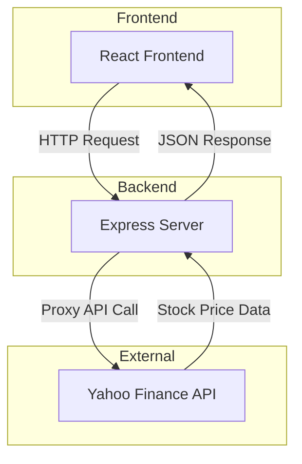

# Stock Gift Value Calculator

A React web application that calculates the IRS-approved donated value of stock gifts using IRS guidelines.

## Overview

This application helps users calculate the value of stock donations according to IRS rules. The IRS specifies that the value of donated stock is calculated as the average of the high and low prices on the donation date.

**Formula**: `(High + Low) / 2 × Number of Shares`

## Features

- Simple input interface for donation date, ticker symbol, and number of shares
- Automatic calculation as you type
- Support for multiple stock gifts
- Fractional cents precision for accurate calculations
- Smart caching to minimize API calls
- Comprehensive error handling
- Responsive design

## Tech Stack

- **React 18** + **TypeScript** - UI framework with type safety
- **Vite** - Fast build tool and dev server
- **Express** - Node.js web server for API and static file serving
- **Vitest + MSW** - Unit testing with API mocking
- **Yahoo Finance API** - Historical stock price data (proxied through backend)
- **CSS Modules** - Component-scoped styling

## Architecture

This is a full-stack application with an Express backend that serves both API endpoints and static files:



**Why a backend?**
- Yahoo Finance doesn't support CORS (requires server-side proxy)
- Ticker symbol normalization (e.g., BRK.B → BRK-B)
- Secure API handling

**Clean architecture:**
- `api/handler.ts` - Platform-agnostic business logic (fully testable)
- `api/server.ts` - Express server that uses the handler and serves static files

## Getting Started

### Prerequisites

- **Node.js 22+** (required for Vite 7+)
- **npm 10+**

**Quick install with nvm:**
```bash
nvm install 22
nvm use 22
```

Or download from [nodejs.org](https://nodejs.org/)

### Installation

```bash
cd typescript/stock-gift-value
npm install
```

### Development

Run both frontend and backend in separate terminals:

**Terminal 1 - Frontend:**
```bash
npm run dev
```
Runs on http://localhost:5173 with hot reload

**Terminal 2 - Backend:**
```bash
npm run dev:api
```
Runs on http://localhost:3001 with auto-restart

The Vite dev server proxies `/api/*` requests to the Express server.

### Production Build

```bash
npm run build:all  # Builds both frontend and server
npm start          # Runs production server on port 3001
```

**Environment variables:**
Create a `.env` file:
```bash
PORT=3001
NODE_ENV=production
```

### Testing

```bash
npm test                  # Run tests once
npm run test:watch        # Run tests in watch mode
npm run test:coverage     # Run tests with coverage
```

### Code Quality

```bash
npm run lint              # Run ESLint
npm run format            # Format code with Prettier
npm run format:check      # Check formatting
```

## Deployment

This is a standard Node.js Express app that can be deployed to any platform supporting Node.js 22+:

- **Google Cloud Platform** (App Engine, Cloud Run, Compute Engine)
- **AWS** (Elastic Beanstalk, EC2, ECS)
- **Azure** (App Service, Container Instances)
- **Railway, Render, Fly.io, Heroku, DigitalOcean**

**General deployment steps:**
1. Build: `npm run build:all`
2. Set environment: `NODE_ENV=production PORT=3001`
3. Start: `npm start`

**Docker deployment:**
See the Dockerfile example in the full documentation.

## Usage

1. Enter the **donation date** (must be a past date)
2. Enter the **ticker symbol** (e.g., AAPL, BRK.B, MSFT)
3. Enter the **number of shares** donated
4. The **IRS-approved value** is calculated automatically

Click **"+ Add Another Stock Gift"** for multiple donations.

## Example

For the test case:
- Date: 11/7/2025
- Ticker: BRK.B
- Shares: 34
- High: $500.16, Low: $493.35
- **Calculated Value: $16,889.67**

The calculation: `(500.16 + 493.35) / 2 × 34 = 496.755 × 34 = $16,889.67`

## Project Structure

```
typescript/stock-gift-value/
├── api/                     # Backend API
│   ├── handler.ts           # Platform-agnostic business logic
│   ├── server.ts            # Express server
│   └── __tests__/           # API tests
├── src/                     # React frontend
│   ├── components/          # React components
│   ├── services/            # API client and caching
│   ├── utils/               # Helper functions
│   └── test/                # Test configuration
├── dist/                    # Built frontend (gitignored)
├── dist-server/             # Built server (gitignored)
├── package.json
├── tsconfig.json            # Frontend TypeScript config
├── tsconfig.server.json     # Server TypeScript config
└── vite.config.ts
```

## Scripts Reference

| Script | Description |
|--------|-------------|
| `npm run dev` | Start Vite dev server (frontend) |
| `npm run dev:api` | Start Express dev server (backend) |
| `npm run build` | Build frontend to `dist/` |
| `npm run build:server` | Build server to `dist-server/` |
| `npm run build:all` | Build both frontend and server |
| `npm start` | Run production server |
| `npm test` | Run tests once |
| `npm run test:watch` | Run tests in watch mode |
| `npm run test:coverage` | Run tests with coverage |
| `npm run lint` | Run ESLint |
| `npm run format` | Format code with Prettier |
| `npm run format:check` | Check code formatting |

## CI/CD

GitHub Actions workflow automatically runs on pushes:
1. ESLint code quality checks
2. Prettier formatting checks
3. All unit tests (70 tests)
4. Frontend build
5. Server build

## IRS Guidelines

According to IRS guidelines, the fair market value of donated stock is determined by taking the mean between the highest and lowest quoted selling prices on the valuation date. This application implements this calculation precisely.

## License

This project is part of the ai-playground repository.

## Contributing

1. Ensure all tests pass: `npm test`
2. Ensure code is formatted: `npm run format`
3. Ensure linting passes: `npm run lint`
4. Build successfully: `npm run build:all`
