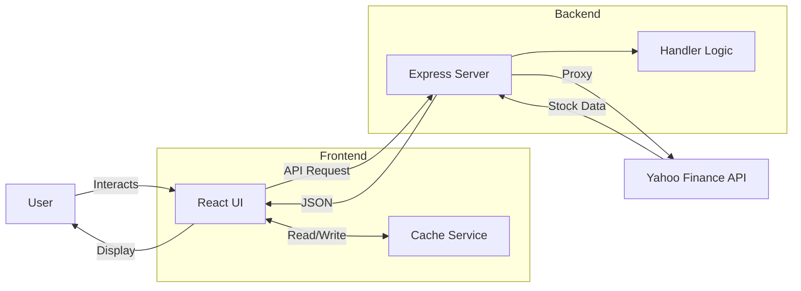
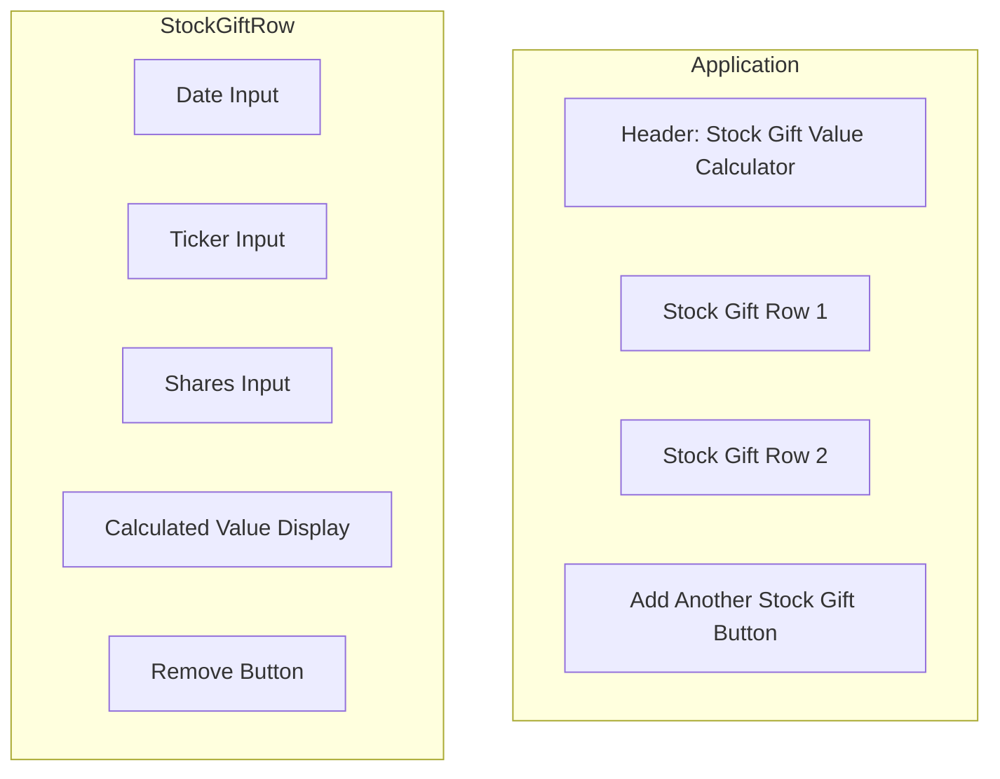

# Stock Gift Value Calculator - Design Specification

## Overview

A React web application to calculate the IRS-approved donated value of stock gifts using the formula: `(High + Low) / 2 × Number of Shares`

## Requirements

### Functional Requirements

1. **Input Fields**
   - Date of stock donation (date picker)
   - Stock ticker symbol (text input, auto-uppercase)
   - Number of shares (numeric input)

2. **Output**
   - Auto-calculated IRS-approved value with fractional cents precision
   - Updates immediately when all inputs are provided

3. **Multi-row Support**
   - Add/remove rows for multiple stock gifts
   - Independent calculation per row

4. **Stock Price API**
   - Fetch historical high/low prices from Yahoo Finance
   - Client-side caching (24-hour TTL)
   - Graceful error handling

5. **User Experience**
   - Responsive layout
   - Loading states
   - Clear error messages

### Non-Functional Requirements

1. **Testing**
   - 70+ unit and integration tests
   - Component tests with React Testing Library
   - API mocking with MSW
   - Required test: BRK.B on 11/7/2025 with 34 shares = $16,889.67

2. **Code Quality**
   - TypeScript strict mode
   - ESLint + Prettier
   - Zero warnings allowed

3. **CI/CD**
   - GitHub Actions on push
   - Runs linting, formatting, tests, and builds
   - Fails on any check failure

## Technical Architecture

### Technology Stack

- **Frontend**: React 18 + TypeScript + Vite
- **Backend**: Express (Node.js)
- **Testing**: Vitest + React Testing Library + MSW
- **API**: Yahoo Finance (proxied through Express)
- **Styling**: CSS Modules

### System Architecture



### Data Models

```typescript
interface StockGift {
  id: string
  date: string          // ISO date format
  ticker: string
  shares: number
  value?: number        // Calculated value
  loading?: boolean
  error?: string
}

interface StockPriceData {
  date: string
  high: number
  low: number
  ticker: string
}

interface CacheEntry {
  data: StockPriceData
  timestamp: number
}
```

### Core Algorithms

**IRS Value Calculation:**
```typescript
function calculateStockGiftValue(high: number, low: number, shares: number): number {
  const averagePrice = (high + low) / 2
  const totalValue = averagePrice * shares
  return Math.round(totalValue * 100) / 100 // Round to cents
}
```

**Caching Strategy:**
- Cache key: `${ticker}-${date}`
- Duration: 24 hours (historical data is immutable)
- Storage: In-memory Map
- Eviction: Time-based expiration

### Error Handling

| Error | Handling |
|-------|----------|
| Invalid ticker | Display error message |
| API rate limiting | Use cached data or show retry message |
| Network errors | User-friendly error |
| Invalid date | Validation with warning |
| Missing data | Show appropriate message |

### UI Layout



**Styling Guidelines:**
- Clean, minimal design
- Responsive grid layout
- Clear visual hierarchy
- Accessible color contrast
- Loading spinners for async operations
- Inline validation messages

## Project Structure

```
typescript/stock-gift-value/
├── api/
│   ├── handler.ts           # Platform-agnostic API logic
│   ├── server.ts            # Express server
│   └── __tests__/
├── src/
│   ├── components/          # React components
│   │   ├── StockGiftCalculator.tsx
│   │   ├── StockGiftRow.tsx
│   │   └── __tests__/
│   ├── services/            # API client and caching
│   │   ├── stockApi.ts
│   │   ├── cache.ts
│   │   └── __tests__/
│   ├── utils/               # Helper functions
│   │   ├── calculations.ts
│   │   └── __tests__/
│   └── test/                # Test configuration & mocks
├── package.json
├── tsconfig.json            # Frontend config
├── tsconfig.server.json     # Backend config
└── vite.config.ts
```

## Test Cases

### Unit Tests
1. **Calculation Logic** - Basic, fractional cents, edge cases
2. **API Integration** - Success, errors, caching
3. **Components** - Render, add/remove rows, validation

### Integration Test
- **BRK.B Test Case**: 11/7/2025, 34 shares → $16,889.67

## Success Criteria

- ✅ All 70 tests pass
- ✅ ESLint reports no errors
- ✅ Prettier formatting applied
- ✅ GitHub Actions workflow succeeds
- ✅ Application runs without console errors
- ✅ UI is responsive and accessible
- ✅ API caching works correctly

## Implementation Status

**Completed Phases:**
1. ✅ Project Setup - Vite + React + TypeScript + ESLint + Prettier
2. ✅ Core Functionality - Calculations, API integration, caching
3. ✅ UI Components - StockGiftRow, StockGiftCalculator
4. ✅ Testing - 70 tests with full coverage
5. ✅ CI/CD - GitHub Actions workflow
6. ✅ Backend - Standalone Express server (removed Vercel dependency)

## Phase 7: Spreadsheet-Style Interface (In Progress)

### Overview

Transform the application from individual card-based rows to a true spreadsheet-like experience with a grid layout, common header, sorting, dynamic row management, and keyboard navigation.

### User Interface Design

#### Grid Layout

**Structure:**
- Replace individual `StockGiftRow` components with a single `<table>` element
- Common header row with column titles: Date | Ticker | Shares | Value
- All data rows in a consistent grid below the header
- Fixed column widths for consistent alignment:
  - Date: 200px
  - Ticker: 150px
  - Shares: 150px
  - Value: 200px
  - Actions: 80px (copy/delete icons)

**Visual Design:**
- Header row: Bold text, bottom border, light gray background (#f9fafb)
- Data rows: Alternating row colors for readability (white / #f9fafb)
- Hover state: Slight background color change (#f3f4f6)
- Cell borders: Subtle 1px borders between cells (#e5e7eb)
- Focus indicators: Blue outline (2px solid #3b82f6) on focused input

#### Column Sorting

**Functionality:**
- Click on any column header to sort by that column
- Sort states: ascending → descending → unsorted (cycles through)
- Visual indicators:
  - Unsorted: Sort icon (↕)
  - Ascending: Up arrow (↑)
  - Descending: Down arrow (↓)
- Sort applies to all non-empty rows
- Empty row always stays at the bottom

**Sort Behavior by Column:**
- Date: Chronological order (oldest to newest / newest to oldest)
- Ticker: Alphabetical order (A-Z / Z-A)
- Shares: Numeric order (smallest to largest / largest to smallest)
- Value: Numeric order, with loading/error states sorted to end

**Implementation:**
- Store sort state: `{ column: 'date' | 'ticker' | 'shares' | 'value' | null, direction: 'asc' | 'desc' }`
- Sorting function applies to `gifts` array before rendering
- Header cells are clickable buttons with appropriate ARIA labels

#### Dynamic Row Management

**Automatic Row Addition:**
- Application starts with exactly one empty row
- When user enters any data into the last (empty) row:
  - Create a new empty row below it immediately
  - Assign new unique ID
  - Only trigger on first keystroke/input change
- Continue adding new rows until 50-row limit is reached
- At 50 rows, no more blank rows are added

**Automatic Row Removal:**
- When user clears all fields in a row (date, ticker, and shares are all empty):
  - Remove that row from the array
  - Exception: Never remove the last row if it would leave zero rows
  - Always maintain at least one empty row at the bottom
- Rows with any data (even just one field) are never auto-removed
- Manual delete button always available for explicit removal

**Edge Cases:**
- If user deletes multiple rows rapidly, always keep one empty row
- If at 50-row limit and user clears a row, a new blank row appears (bringing total back to 50)
- Empty row detection: `!date && !ticker && !shares` (ignore value/loading/error)

#### Copy to Spreadsheet Functionality

**Feature:**
- Copy icon (📋) button in the header row, aligned to the right
- Clicking copies all non-empty rows to clipboard in TSV (tab-separated values) format
- Format includes header row:
  ```
  Date    Ticker    Shares    Value
  2024-01-15    AAPL    100    $14,500.00
  2024-02-20    GOOGL    50    $6,750.25
  ```

**Implementation Details:**
- Use Clipboard API: `navigator.clipboard.writeText()`
- Filter out empty rows (rows where all inputs are blank)
- Format values with dollar sign and comma separators
- Handle loading states: show "Loading..." text
- Handle error states: show "Error" text
- Tab character (`\t`) between columns, newline (`\n`) between rows
- Show brief success message after copy (toast or temporary message)

**Accessibility:**
- Button has clear ARIA label: "Copy all data to clipboard"
- Keyboard accessible
- Success message announced to screen readers

#### Keyboard Navigation

**Arrow Key Navigation:**
- **Up Arrow**: Move focus to cell directly above in same column
- **Down Arrow**: Move focus to cell directly below in same column
- **Left Arrow**: Move focus to cell to the left in same row
- **Right Arrow**: Move focus to cell to the right in same row
- Wrap behavior: None (arrows do nothing at edges)
- Skip read-only cells: When navigating, skip the Value column (read-only)

**Tab Key Navigation:**
- **Tab**: Move focus to next editable cell (right, then wrap to next row)
- **Shift+Tab**: Move focus to previous editable cell (left, then wrap to previous row)
- Tab order: Date → Ticker → Shares → (skip Value) → next row Date
- When reaching the end of the last row with data, tab wraps to first cell

**Enter Key Navigation:**
- **Enter**: Move focus to cell directly below in same column
- If on last row, create new row if under 50-row limit
- Enter key does NOT submit form or create new rows unintentionally

**Focus Management:**
- Track current cell position: `{ rowId: string, field: 'date' | 'ticker' | 'shares' }`
- Use refs to manage focus programmatically
- Focus visible indicator: Blue outline on active cell
- Initial focus: First cell (Date) of first row on component mount

**Implementation Approach:**
- Attach `onKeyDown` handlers to each input cell
- Intercept arrow keys, tab, and enter before default behavior
- Calculate next cell position based on current position and key pressed
- Use `useRef` with a map/array structure to reference all input elements
- Call `.focus()` on target input element

### Data Model Changes

**StockGift Interface (Updated):**
```typescript
interface StockGift {
  id: string              // Unique ID (UUID)
  date: string            // ISO date format, empty string for new rows
  ticker: string          // Uppercase ticker symbol, empty string for new rows
  shares: number | ''     // Number of shares, empty string for new rows
  value?: number          // Calculated value (optional)
  loading?: boolean       // Loading state
  error?: string          // Error message
  cacheKey?: string       // Cache key for API results
}
```

**New State:**
```typescript
// In StockGiftCalculator component
const [sortConfig, setSortConfig] = useState<{
  column: 'date' | 'ticker' | 'shares' | 'value' | null
  direction: 'asc' | 'desc'
} | null>(null)

const [focusedCell, setFocusedCell] = useState<{
  rowId: string
  field: 'date' | 'ticker' | 'shares'
} | null>(null)
```

### Component Architecture

**New Component Structure:**

```
StockGiftCalculator (Container)
├── StockGiftTable (New - Table wrapper)
│   ├── StockGiftTableHeader (New - Header row with sorting)
│   └── StockGiftTableBody (New - Body with rows)
│       └── StockGiftTableRow (Refactored - Single row in table)
│           ├── DateCell
│           ├── TickerCell
│           ├── SharesCell
│           ├── ValueCell (read-only)
│           └── ActionsCell (delete button)
```

**Alternative Simpler Architecture:**
```
StockGiftCalculator (Container)
├── <table> element with header and body inline
└── Direct rendering of rows
```

Choose the simpler architecture to minimize refactoring complexity while maintaining readability.

### Testing Strategy

#### Test Categories

1. **Grid Layout & Rendering Tests**
   - Table structure renders with correct semantic HTML
   - Header row displays all column titles
   - Empty row renders on initial load
   - Multiple rows render in correct order

2. **Sorting Tests**
   - Click on Date header sorts by date (asc/desc/unsorted)
   - Click on Ticker header sorts alphabetically
   - Click on Shares header sorts numerically
   - Click on Value header sorts by calculated value
   - Empty row stays at bottom during sort
   - Sort indicators display correctly

3. **Dynamic Row Management Tests**
   - Starts with one empty row
   - Typing in empty row creates new blank row below
   - New row only created once per empty row
   - Clearing all fields in a row removes it
   - Last empty row is never removed
   - At 50 rows, no new blank rows are added
   - After deleting row at limit, new blank row appears

4. **Keyboard Navigation Tests**
   - Arrow up/down moves focus vertically
   - Arrow left/right moves focus horizontally
   - Tab moves to next editable cell
   - Shift+Tab moves to previous editable cell
   - Enter moves focus down
   - Focus skips read-only Value column
   - Navigation respects grid boundaries

5. **Copy Functionality Tests**
   - Copy button exists and is accessible
   - Clicking copy button calls clipboard API
   - Copied text is in TSV format with headers
   - Empty rows are excluded from copy
   - Loading/error states are handled in copied text
   - Success message appears after copy

#### Test Implementation Approach

- Use Vitest + React Testing Library
- Mock `navigator.clipboard.writeText` with `vi.fn()`
- Use `userEvent` for realistic interactions
- Use `fireEvent.keyDown` for keyboard events
- Add custom render utilities for keyboard navigation testing
- Maintain existing MSW setup for API mocking

### Migration Plan

**Phase 1: Update SPEC.md** ✅
- Document spreadsheet design
- Push to GitHub

**Phase 2: Write Failing Tests**
- Create test files for new functionality
- Run tests to verify they fail
- Commit failing tests

**Phase 3: Implement Features**
- Step 1: Convert to table layout with common header
- Step 2: Add sorting functionality
- Step 3: Implement dynamic row management
- Step 4: Add keyboard navigation
- Step 5: Implement copy functionality
- Commit after each major step

**Phase 4: Validation**
- Run all tests (new + existing)
- Run linter and type checker
- Test manually in browser
- Fix any issues

**Phase 5: Deployment**
- Push to GitHub
- Verify GitHub Actions pass
- Create pull request

### Accessibility Considerations

- Semantic HTML: Use `<table>`, `<thead>`, `<tbody>`, `<tr>`, `<th>`, `<td>` elements
- ARIA labels: Add appropriate labels to sortable headers and buttons
- Keyboard navigation: Full keyboard support without requiring mouse
- Focus indicators: Clear visual indication of focused cell
- Screen reader support: Announce sort changes and row additions/removals
- Color contrast: Maintain WCAG AA compliance for all text and borders

### Performance Considerations

- Debounce row addition logic to avoid excessive re-renders
- Memoize sorted array to avoid re-sorting on every render
- Use `React.memo` for row components to prevent unnecessary re-renders
- Virtualization: Not needed for 50-row limit (defer to future if needed)

## Future Enhancements (Out of Scope)

- Total value across all gifts
- Export to CSV/PDF with formatting
- Historical donation tracking
- Support for mutual funds
- Tax deduction calculations
- Column resizing
- Row reordering via drag-and-drop
- Undo/redo functionality
- Virtual scrolling for >50 rows
