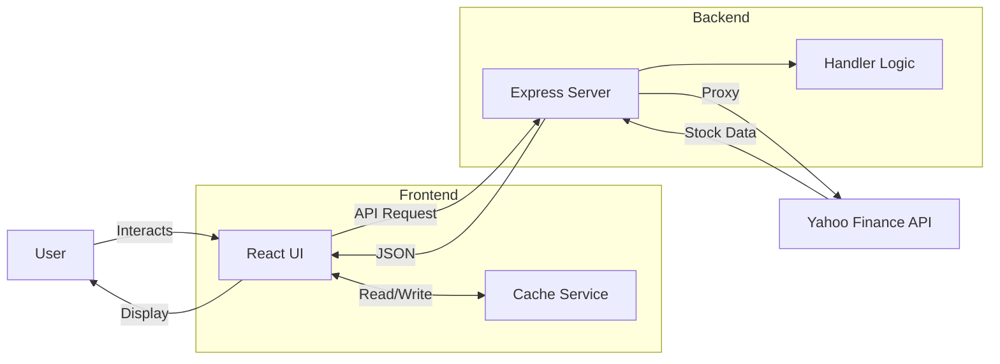
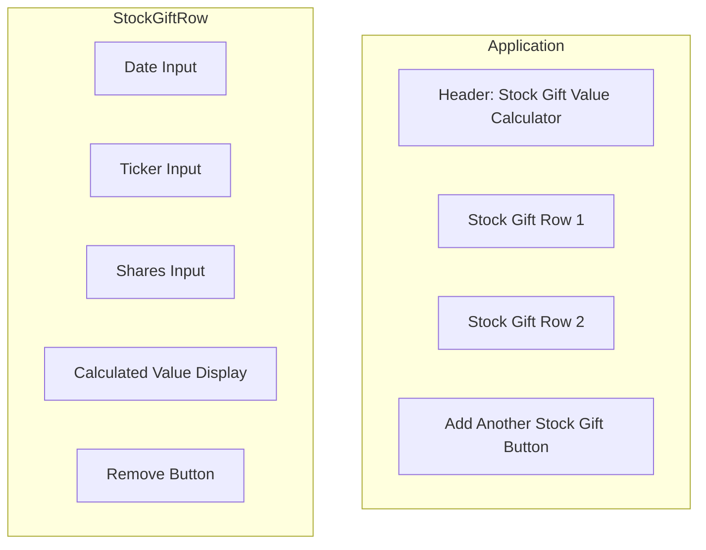

# Stock Gift Value Calculator - Design Specification

## Overview

A React web application to calculate the IRS-approved donated value of stock gifts using the formula: `(High + Low) / 2 × Number of Shares`

## Requirements

### Functional Requirements

1. **Input Fields**
   - Date of stock donation (date picker)
   - Stock ticker symbol (text input, auto-uppercase)
   - Number of shares (numeric input)

2. **Output**
   - Auto-calculated IRS-approved value with fractional cents precision
   - Updates immediately when all inputs are provided

3. **Multi-row Support**
   - Add/remove rows for multiple stock gifts
   - Independent calculation per row

4. **Stock Price API**
   - Fetch historical high/low prices from Yahoo Finance
   - Client-side caching (24-hour TTL)
   - Graceful error handling

5. **User Experience**
   - Responsive layout
   - Loading states
   - Clear error messages

### Non-Functional Requirements

1. **Testing**
   - 70+ unit and integration tests
   - Component tests with React Testing Library
   - API mocking with MSW
   - Required test: BRK.B on 11/7/2025 with 34 shares = $16,889.67

2. **Code Quality**
   - TypeScript strict mode
   - ESLint + Prettier
   - Zero warnings allowed

3. **CI/CD**
   - GitHub Actions on push
   - Runs linting, formatting, tests, and builds
   - Fails on any check failure

## Technical Architecture

### Technology Stack

- **Frontend**: React 18 + TypeScript + Vite
- **Backend**: Express (Node.js)
- **Testing**: Vitest + React Testing Library + MSW
- **API**: Yahoo Finance (proxied through Express)
- **Styling**: CSS Modules

### System Architecture



### Data Models

```typescript
interface StockGift {
  id: string
  date: string          // ISO date format
  ticker: string
  shares: number
  value?: number        // Calculated value
  loading?: boolean
  error?: string
}

interface StockPriceData {
  date: string
  high: number
  low: number
  ticker: string
}

interface CacheEntry {
  data: StockPriceData
  timestamp: number
}
```

### Core Algorithms

**IRS Value Calculation:**
```typescript
function calculateStockGiftValue(high: number, low: number, shares: number): number {
  const averagePrice = (high + low) / 2
  const totalValue = averagePrice * shares
  return Math.round(totalValue * 100) / 100 // Round to cents
}
```

**Caching Strategy:**
- Cache key: `${ticker}-${date}`
- Duration: 24 hours (historical data is immutable)
- Storage: In-memory Map
- Eviction: Time-based expiration

### Error Handling

| Error | Handling |
|-------|----------|
| Invalid ticker | Display error message |
| API rate limiting | Use cached data or show retry message |
| Network errors | User-friendly error |
| Invalid date | Validation with warning |
| Missing data | Show appropriate message |

### UI Layout



**Styling Guidelines:**
- Clean, minimal design
- Responsive grid layout
- Clear visual hierarchy
- Accessible color contrast
- Loading spinners for async operations
- Inline validation messages

## Project Structure

```
typescript/stock-gift-value/
├── api/
│   ├── handler.ts           # Platform-agnostic API logic
│   ├── server.ts            # Express server
│   └── __tests__/
├── src/
│   ├── components/          # React components
│   │   ├── StockGiftCalculator.tsx
│   │   ├── StockGiftRow.tsx
│   │   └── __tests__/
│   ├── services/            # API client and caching
│   │   ├── stockApi.ts
│   │   ├── cache.ts
│   │   └── __tests__/
│   ├── utils/               # Helper functions
│   │   ├── calculations.ts
│   │   └── __tests__/
│   └── test/                # Test configuration & mocks
├── package.json
├── tsconfig.json            # Frontend config
├── tsconfig.server.json     # Backend config
└── vite.config.ts
```

## Test Cases

### Unit Tests
1. **Calculation Logic** - Basic, fractional cents, edge cases
2. **API Integration** - Success, errors, caching
3. **Components** - Render, add/remove rows, validation

### Integration Test
- **BRK.B Test Case**: 11/7/2025, 34 shares → $16,889.67

## Success Criteria

- ✅ All 70 tests pass
- ✅ ESLint reports no errors
- ✅ Prettier formatting applied
- ✅ GitHub Actions workflow succeeds
- ✅ Application runs without console errors
- ✅ UI is responsive and accessible
- ✅ API caching works correctly

## Implementation Status

**Completed Phases:**
1. ✅ Project Setup - Vite + React + TypeScript + ESLint + Prettier
2. ✅ Core Functionality - Calculations, API integration, caching
3. ✅ UI Components - StockGiftRow, StockGiftCalculator
4. ✅ Testing - 70 tests with full coverage
5. ✅ CI/CD - GitHub Actions workflow
6. ✅ Backend - Standalone Express server (removed Vercel dependency)

## Future Enhancements (Out of Scope)

- Total value across all gifts
- Export to CSV/PDF
- Historical donation tracking
- Support for mutual funds
- Tax deduction calculations
